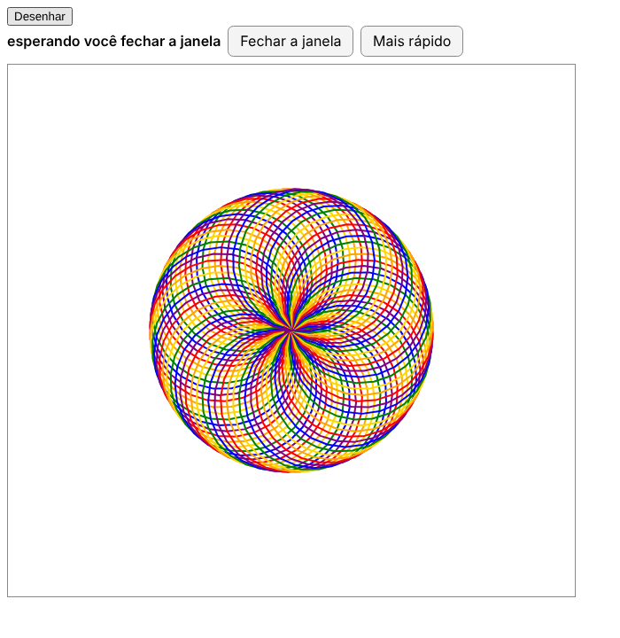

# turtleweb

**O `import turtle` do Python, desenhando no navegador.**

Quem já ensinou Python para criança sabe: o `turtle` é mágico. Três linhas e aparece uma tartaruga andando na tela,
desenhando um quadrado, uma estrela, uma espiral colorida. O problema é *onde* ela aparece: numa janela do Tk, no
computador onde o Python está rodando. Se o Python roda num servidor, num Raspberry Pi no canto da sala ou na nuvem, a
janela abre lá, longe de quem está programando.

O turtleweb resolve isso. O programa continua exatamente igual:

```python
import turtle

t = turtle.Turtle()
for i in range(4):
    t.forward(100)
    t.left(90)
turtle.done()
```

só que o desenho aparece numa página web, no navegador: no computador, no iPad, no celular. O Python
continua rodando no servidor, de verdade, com `input()`, `print()`, arquivos, tudo. E o servidor nem precisa ter Tkinter
instalado.



## O que dá para fazer

Praticamente tudo o que se faz com o `turtle` numa aula:

- desenhar com `forward`, `left`, `circle`, `goto`, `dot`, `stamp`, `write`, preencher com `begin_fill`/`end_fill`, mudar
  cores, espessura, fundo, título e tamanho da janela;
- animação na mesma velocidade do Tk (`speed`, `tracer`, `update`), com um botão **Mais rápido** para quem tem pressa;
- jogos e programas interativos: `onkey`, `onkeypress`, `onscreenclick`, `onclick` na tartaruga, `ondrag`, `ontimer`,
  `listen`;
- `textinput` e `numinput` abrem uma caixinha na própria página;
- no iPad e no celular: toque funciona como clique, aparecem botões de seta na tela quando o programa usa o teclado,
  e um botão **⌨️ Teclado** abre o teclado do aparelho.

E tem o que acontece em volta do programa: a página mostra se ele está rodando, esperando (`turtle.done()`), se terminou,
se deu erro ou se foi parado. O desenho fica na tela até a próxima execução.

## Por que confiar no desenho

O turtleweb **não reescreve o turtle**. Ele usa o módulo `turtle` que vem com o próprio Python, sem mudar uma linha, e
troca só o pedaço de baixo: o `tkinter`. No lugar do Tk entra um Tk "de mentira" que, em vez de pintar pixels numa janela,
anota cada traço e manda para o navegador. Toda a lógica (para onde a tartaruga vai, como o círculo é feito, quando a
animação espera) continua sendo a do Python de verdade.

Por isso dá para medir a fidelidade, e medimos: nos 36 programas comparados, o turtleweb e o Tk de verdade produzem os
mesmos traços, nas mesmas coordenadas (diferença máxima de meio pixel), com as mesmas cores. A espiral de referência leva
cerca de 13 segundos no Tk e o mesmo tanto no navegador.

## Experimente em dois minutos

Você precisa de Python 3.10 ou mais novo.

```
git clone https://github.com/imphat/turtleweb
cd turtleweb
pip install flask
python demo/app.py
```

Abra <http://127.0.0.1:5000>, escolha um programa na lista e clique em **▶ Executar**. São mais de 50 programas de
exemplo, de um quadrado até um jogo de pegar bolinha.

Quer abrir no iPad ou no celular? Rode com `python demo/app.py --host 0.0.0.0` e acesse pelo IP do computador, na mesma
rede Wi-Fi.

## Usando no seu projeto

Instale no mesmo ambiente do seu servidor:

```
pip install git+https://github.com/imphat/turtleweb
```

O turtleweb não depende de nada. O Flask só é necessário se você quiser usar o blueprint pronto.

O caminho mais curto é o `demo/minimo.py`, um app inteiro em umas 50 linhas: uma página com um botão que roda um programa e
mostra o desenho. O coração dele é isto:

```python
from turtleweb import Hub, Session
from turtleweb.flask_blueprint import create_blueprint

hub = Hub()
app.register_blueprint(create_blueprint(hub), url_prefix="/turtleweb")

@app.post("/rodar")
def rodar():
    session = hub.add(Session())
    session.start("desenho.py")          # roda o programa como um processo separado
    return {"sid": session.sid}
```

e, na página:

```html
<div id="area"></div>
<script src="/turtleweb/turtleweb.js"></script>
<script>
  const tw = TurtleWeb.mount(document.getElementById("area"), {base: "/turtleweb"});
  // depois de chamar /rodar:
  tw.attach(sid);
</script>
```

Se o seu app já roda os programas dos alunos por conta própria (com `subprocess`), você não precisa trocar nada disso:
basta passar o ambiente que o turtleweb prepara. O [guia de integração](INTEGRACAO.md) mostra como, passo a passo, e
explica o que muda (quase nada) no que você já tem.

## Como funciona, em uma figura

```
 programa do aluno  (processo separado, Python normal)
   import turtle ──► turtle da biblioteca padrão ──► tkinter falso do turtleweb
                                                         │  traços, em JSON, por um socket local
                                                         ▼
 seu servidor (Flask ou outro)  ── Session ──►  página (turtleweb.js, um arquivo só, sem framework)
                                ◄── cliques, teclas, respostas do textinput ──
```

Quando o processo do aluno começa, um `sitecustomize` troca o `tkinter` antes de o `turtle` ser importado. O programa não
fica sabendo de nada. O canal com o servidor é um socket em `127.0.0.1`, então o `input()` e o `print()` continuam livres
para o seu app usar como sempre usou. Nada ali depende do sistema: foi testado em Linux e macOS, e deve funcionar
igual no Windows (ainda não testamos).

Os detalhes estão em [docs/como-funciona.md](docs/como-funciona.md) (para quem quer entender ou mexer no código) e em
[docs/contrato.md](docs/contrato.md) (as mensagens trocadas, se você quiser escrever o seu próprio servidor ou página).

## O que ainda não faz

- Formas e fundos com imagem (`register_shape("gato.gif")`, `bgpic`).
- O tamanho de texto é estimado no servidor, então `write(..., move=True)` pode errar a posição por alguns pixels.
- Atalhos com Ctrl, Alt ou Cmd não chegam ao programa (para não brigar com os atalhos do navegador).
- Não tem login. Se o seu servidor fica exposto, proteja as rotas do turtleweb com a autenticação do seu app.
- As execuções ficam na memória de um processo só: rode o servidor com um processo e várias threads.

Tem ideia de como resolver algum desses? Veja [IDEIAS.md](IDEIAS.md).

## Rodando os testes

```
pip install pytest flask playwright
cd tests
python -m pytest -q
```

A suíte roda todos os programas de `corpus/` e confere três coisas: a lista de comandos que cada programa executou, os
traços comparados com o Tk de verdade e o resultado num navegador sem janela. Os testes que precisam de Tk (com
`xvfb-run`) ou de Chromium pulam sozinhos se o seu computador não tiver essas peças.

## Organização do repositório

```
turtleweb/       a biblioteca
  _fake_tk.py      o tkinter falso: onde os traços viram mensagens e os cliques viram eventos
  session.py       o lado do servidor: abre o socket, guarda o desenho, repassa eventos
  flask_blueprint.py  as rotas prontas para Flask
  static/turtleweb.js a página: desenha no <canvas> e manda cliques e teclas
demo/            servidor de demonstração (app.py) e o exemplo mínimo (minimo.py)
corpus/          os programas de teste e o resultado esperado de cada um
tests/           a suíte de testes
docs/            como funciona por dentro e o formato das mensagens
```

## De onde veio

O turtleweb nasceu para um app em que crianças de 8 a 12 anos aprendem Python com um tutor. A ideia era rodar o app num
servidor (um Raspberry Pi, por exemplo) e usar de qualquer aparelho, inclusive um iPad, sem mudar uma linha dos
programas que as crianças já escrevem. Antes de escrever código, procuramos o que já existia (Skulpt, Brython, Pyodide, ColabTurtle e
outros); nenhum rodava o Python no servidor com eventos e `textinput`. Essa pesquisa, as decisões e os relatórios de cada
etapa estão no repositório: [PESQUISA.md](PESQUISA.md), [DECISOES.md](DECISOES.md), [SPEC.md](SPEC.md) e os arquivos
`RELATORIO-*.md`.

Contribuições são muito bem-vindas: um programa de turtle que não funciona direito, um teste num navegador diferente, uma
correção. Abra uma issue ou mande um pull request.

## Licença

MIT. Pode usar, modificar e distribuir à vontade, inclusive em projetos comerciais; só mantenha o aviso de copyright.
Detalhes em [LICENSE](LICENSE).
